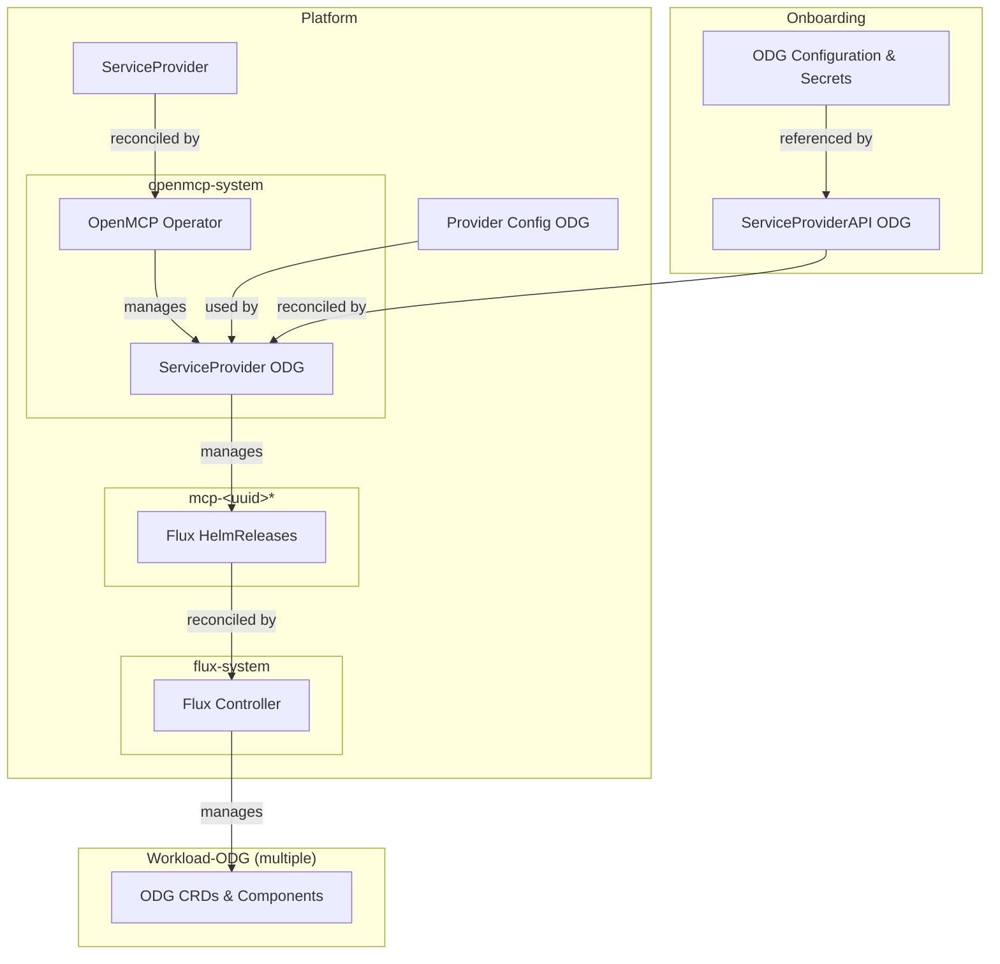
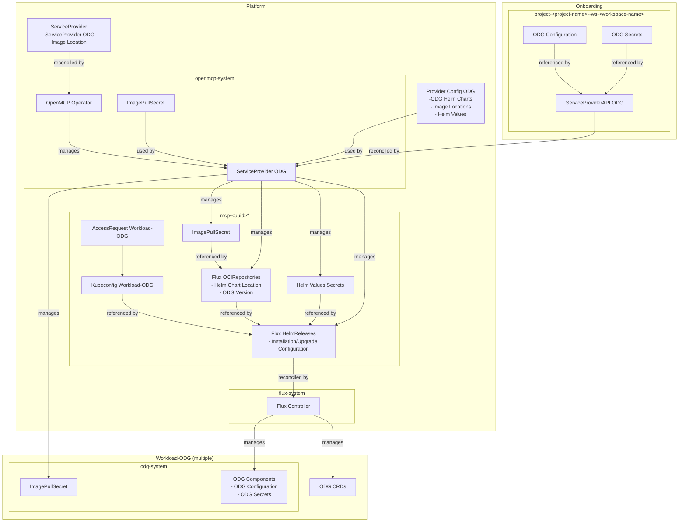

# service-provider-odg

An [OpenControlPlane](https://github.com/openmcp-project) Service Provider that installs and manages
the [Open Delivery Gear (ODG)](https://github.com/open-component-model/open-delivery-gear) on ODG
workload clusters via Flux HelmReleases.

[](https://api.reuse.software/info/github.com/open-component-model/service-provider-odg)

## How It Works

When an `ODG` resource is created on the onboarding cluster, the controller:

1. Resolves the necessary Helm charts (URLs, versions, pull secrets, Helm values) from the `ProviderConfig`
2. Replicates the pull secrets into the tenant namespace on the platform cluster and the target namespace on the ODG workload cluster
3. Creates a Flux `OCIRepository` per chart in the tenant namespace, pointing at the chart URL, version and the pull secret.
4. Creates a `Secret` per chart in the tenant namespace containing the resolved Helm values
5. Creates a Flux `HelmRelease` per chart that deploys it into `odg-system` on the ODG workload cluster via a kubeconfig reference
6. Deletes any resources of chart which are now longer advertised in the `ProviderConfig` from the tenant namespace



<details>
<summary>Detailed Architecture</summary>


</details>

## API Reference

### ODG

The service provider API. Created on the onboarding cluster, one per tenant.

```yaml
apiVersion: odg.services.open-control-plane.io/v1alpha1
kind: ODG
metadata:
  name: mcp-01 # must match your MCP cluster so it will track the right cluster
spec:
  configurationRef:
    name: mcp-01-odg-config   # ConfigMap in the same namespace
  secretsRef:
    name: mcp-01-odg-secrets  # Secret in the same namespace
```

Both the `ConfigMap` and the `Secret` must have a `values.yaml` key containing a YAML document
whose structure mirrors the bootstrapping chart's values schema. The controller deep-merges them
in order — `configurationRef` first, `secretsRef` on top — and writes the result into the Helm
values `Secret` for the `bootstrapping` chart.

| Field                        | Type     | Required     | Description                                                                                                                                                              |
|------------------------------|----------|--------------|--------------------------------------------------------------------------------------------------------------------------------------------------------------------------|
| `spec.configurationRef`      | `object` | no           | Reference to a `ConfigMap` in the same namespace. Its `values.yaml` key is merged into the bootstrapping chart's Helm values.                                            |
| `spec.configurationRef.name` | `string` | yes (if set) | Name of the `ConfigMap`.                                                                                                                                                 |
| `spec.secretsRef`            | `object` | no           | Reference to a `Secret` in the same namespace. Its `values.yaml` key is merged on top of the ConfigMap values. Use this for sensitive configuration such as credentials. |
| `spec.secretsRef.name`       | `string` | yes (if set) | Name of the `Secret`.                                                                                                                                                    |

_Note_: The name of the object _**MUST**_ match the name of your MCP cluster offering. This
ensures that only one installation can exist for a given cluster.

### ProviderConfig

Cluster-scoped operational configuration. Declares which ODG Helm charts will be deployed and
which Helm values will be used by default.

```yaml
apiVersion: odg.services.open-control-plane.io/v1alpha1
kind: ProviderConfig
metadata:
  name: odg
spec:
  charts:
    - chartName: bootstrapping
      chartPullSecretName: privateregcred
      chartURL: europe-docker.pkg.dev/gardener-project/releases/charts/odg/bootstrapping
      chartVersion: 0.1369.0
      helmValues: {}
    - chartName: delivery-dashboard
      chartPullSecretName: privateregcred
      chartURL: oci://europe-docker.pkg.dev/gardener-project/releases/charts/odg/delivery-dashboard
      chartVersion: 0.440.0
    - chartName: delivery-service
      chartPullSecretName: privateregcred
      chartURL: europe-docker.pkg.dev/gardener-project/releases/charts/odg/delivery-service
      chartVersion: 0.1369.0
  pollInterval: 1m
```

#### `spec`

| Field          | Type       | Required | Default | Description                                                        |
|----------------|------------|----------|---------|--------------------------------------------------------------------|
| `charts`       | `array`    | yes      | —       | The ODG Helm charts and their configuration that will be deployed. |
| `pollInterval` | `duration` | no       | `1m`    | How often the controller polls for changes.                        |

A chart item (`spec.charts[]`) is defined as follows:

| Field                  | Type     | Required | Default | Description                                                                                                                                                                            |
|------------------------|----------|----------|---------|----------------------------------------------------------------------------------------------------------------------------------------------------------------------------------------|
| `chartName`            | `string` | yes      | —       | Unique name of the Helm chart. Used as the name of the generated `OCIRepository`, values `Secret`, and `HelmRelease`.                                                                  |
| `chartURL`             | `string` | yes      | —       | OCI URL of the Helm chart. An `oci://` prefix is added automatically if missing.                                                                                                       |
| `chartVersion`         | `string` | yes      | —       | Tag of the Helm chart to install.                                                                                                                                                      |
| `chartPullSecretName`  | `string` | no       | —       | Name of a secret in the controller's namespace to replicate into the tenant namespace and set as `secretRef` on the `OCIRepository`. Must be of type `kubernetes.io/dockerconfigjson`. |
| `helmValues`           | `object` | no       | —       | Arbitrary Helm values passed directly to the `HelmRelease`.                                                                                                                            |

## Running E2E Tests

The e2e tests spin up a full local OCP environment with four kind clusters (platform, onboarding, mcp, workload-odg) and verify the ODG deployment flow: pull secret replication, OCIRepository/HelmRelease creation, chart installation, and pod deployment to the dedicated workload cluster.

### Prerequisites

- Docker (8 GB+ RAM allocated)
- Go 1.26 (not 1.27+ — the linter cannot decode Go 1.27 export data)
- [Task](https://taskfile.dev) (`go-task`)
- Flux CLI (installed automatically by `task install-flux`)

### Running the tests

The e2e test doubles as a local cluster setup. With `--keep-clusters`, the test runs normally but skips teardown, leaving the clusters alive for debugging:

```shell
PATH="$PWD/bin:$PATH" task test-e2e -- --keep-clusters
```

Without the flag, clusters are torn down after tests:

```shell
PATH="$PWD/bin:$PATH" task test-e2e
```

### What the test environment sets up

The test framework (`main_test.go`) configures:

- **`workload-odg` purpose mapping** — the scheduler doesn't know this purpose yet, so it's added via `ExtraClusterPurposeMapping` (kind, Exclusive)
- **FluxCD extension** — installs Flux on the platform cluster during Bootstrap (before platform services), so the SP controller can create OCIRepository/HelmRelease resources
- **Platform service gateway** — installs Envoy Gateway (including Gateway API CRDs) on `workload-odg` clusters via a `GatewayServiceConfig` with `matchPurpose: workload-odg`. Required because the ODG Helm charts include `HTTPRoute` resources
- **Dummy pull secret** — creates a `privateregcred` secret in the SP pod namespace to test the controller's secret replication code path


## Quality Criteria

[](https://open-control-plane.io/developers/serviceprovider/quality-criteria)

| Criterion                         | Status  | Notes |
| --------------------------------- | :----:  | ----- |
| Deletion behaviour                |   ✅    | A finalizer ensures the Service Provider managed resources like Flux' `OCIRepository` and `HelmRelease` are cleaned-up. With that, the deployments in the ODG workload clusters will be terminated as well and the cluster will be evicted. |
| Status reporting & error messages |   ✅    |       |
| Operation annotations             |   ❓    | To be validated |
| API stability policy              |   ❌    |       |
| Custom CA support                 |   ❌    |       |
| Release artifacts (image + OCM)   |   ✅    |       |
| Testing                           |   ✅    |       |
| Ownership and maintenance docs    |   ✅    |       |

See the [OpenControlPlane Quality Criteria](https://open-control-plane.io/developers/serviceprovider/quality-criteria) for definitions.

## Support, Feedback, Contributing

This project is open to feature requests/suggestions, bug reports etc. via [GitHub issues](https://github.com/open-component-model/service-provider-odg/issues). Contribution and feedback are encouraged and always welcome. For more information about how to contribute, the project structure, as well as additional contribution information, see our [Contribution Guidelines](CONTRIBUTING.md).

## Security / Disclosure

If you find any bug that may be a security problem, please follow our instructions in [our security policy](https://github.com/open-component-model/service-provider-odg/security/policy) on how to report it. Please do not create GitHub issues for security-related doubts or problems.

## Code of Conduct

We as members, contributors, and leaders pledge to make participation in our community a harassment-free experience for everyone. By participating in this project, you agree to abide by its [Code of Conduct](https://github.com/open-component-model/.github/blob/main/CODE_OF_CONDUCT.md) at all times.

## Licensing

Copyright OpenControlPlane contributors. Please see our [LICENSE](LICENSE) for copyright and license information. Detailed information including third-party components and their licensing/copyright information is available [via the REUSE tool](https://api.reuse.software/info/github.com/open-component-model/service-provider-odg).

---

<p align="center"></p>
