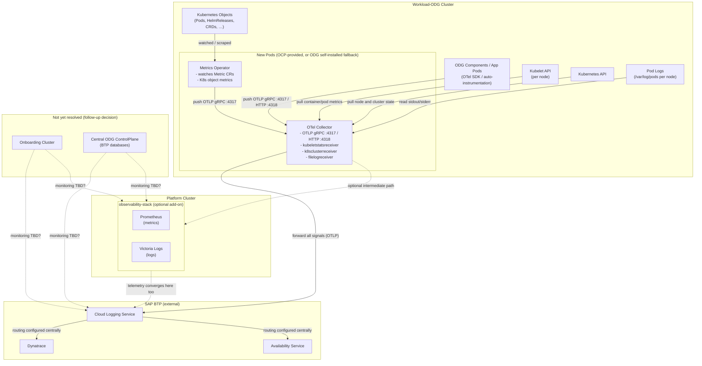

# ADR-008: Observability Stack Approach for ODG on OCP

| Status   | Accepted                                      |
|----------|-----------------------------------------------|
| Date     | 2026-09-15                                    |
| Deciders | ODG Team                                      |

## Context and Problem Statement

ODG runs as a managed service on OCP it's own workload clusters. We need to collect and
expose telemetry (metrics, logs, traces) for those clusters. Two areas require
decisions:

1. **Which observability backend / pipeline to adopt** — the OCP-provided stack
   vs. a fully self-managed one vs a hybrid approach.
2. **How to collect Kubernetes infrastructure metrics** — whether to use the OTel
   Collector receiver path consistently across all clusters, or allow a mix of
   approaches.

## Decision Drivers

* **OCP stack**: OCP will run OTel Collector and
  Metrics Operator as the core of their observability platform — whether that
  lands on the platform cluster, on workload clusters, or elsewhere is still
  being finalised. ODG adopting the same components ensures we are aligned
  regardless of where OCP ends up hosting them.
  Eventually all these metrics will be pushed to a CloudLogging instance.
* **Fallback independence**: If OCP delivery slips past Q4, ODG can self-install
  the same OTel Collector and Metrics Operator and point them at a dedicated
  CloudLogging instance — no change to instrumentation code, no dependency on
  OCP's intermediate Prometheus or Victoria Metrics layer.
* **Operational simplicity**: CloudLogging (SAP BTP) acts as the central hub;
  downstream routing to Dynatrace or the Availability Service is configured
  there, not at the cluster level. This decouples instrumentation from alerting
  decisions.
* **OIDC access to platform tools**: Once the platform cluster exposes OIDC
  access to its Prometheus and Victoria Logs instances, ODG can transparently
  start using those.
* **Uniform metric naming across the fleet**: The OTel Collector receiver path
  and the traditional kube-prometheus-stack use different metric names. Mixing
  approaches across clusters would break fleet-wide dashboard reuse. Picking one
  path and sticking to it is more important than which path we pick.

## Considered Options

### Observability pipeline

1. **OTel Collector + Metrics Operator → CloudLogging** — adopt the OCP stack
   as the primary pipeline. OTel Collector receives OTLP from applications and
   from the Metrics Operator; all data lands in SAP Cloud Logging.
2. **OCP-managed Prometheus + Victoria Logs (observability-stack)** — rely solely 
   on the central observability stack instance on the central platform cluster.
3. **Self-managed Prometheus + Victoria Logs (observability-stack)** — run the
   full openMCP observability-stack on a dedicated cluster owned by ODG.
4. **No central pipeline; per-cluster tooling** — instrument each workload
   cluster independently with no shared backend.

### Kubernetes infrastructure metric collection

1. **OTel Collector receivers consistently** — use `kubeletstatsreceiver`,
   `k8sclusterreceiver`, and `filelogreceiver` inside the OTel Collector to
   gather container/node metrics and pod logs. Single unified push pipeline into
   CloudLogging; same metric names on every cluster.
2. **Mixed approach** — allow individual clusters or teams to use
   kube-prometheus-stack / cAdvisor / node-exporter where convenient. Standard
   community dashboards and alert rules work out of the box, but metric names
   differ from the OTel receiver path and cannot be shared across the fleet.

## Decision Outcome

**Pipeline: Option 1 — OTel Collector + Metrics Operator → CloudLogging.**

**Infrastructure metrics: Option 1 — OTel Collector receivers consistently across all clusters.**

The ideal path: OCP installs Metrics Operator and OTel Collector on the ODG
workload cluster and provides access to a central CloudLogging instance within
the next 2–4 weeks. That gives ODG a working observability pipeline with no
self-managed components.

OCP is building their broader observability platform on the same tooling. The
exact topology — whether components run on the platform cluster, on workload
clusters, or both — is still being finalised, but the tooling choice is the
same. Crucially, even when OCP runs their own intermediate stack (Prometheus,
Victoria Logs), telemetry ultimately flows into CloudLogging as well — so
CloudLogging is the shared convergence point regardless of path. Prometheus and
Victoria Logs are therefore nice addons we may consider later once they are
stable and OIDC access is available, not a prerequisite.

If OCP does not provide these on a given cluster type (e.g. the ODG
ControlPlane), or if delivery slips, ODG self-installs the identical components
and points them directly at CloudLogging or the central observability stack if ready.

For infrastructure metrics the uniformity constraint is the deciding factor:
fleet-wide dashboards only work if every cluster uses the same metric names.
We pick the OTel receiver path and build custom dashboards from the start.
Standard kube-prometheus-stack dashboards are not compatible with these names
and are not a goal.

Whichever team (OCP or ODG) reaches this topic first shares their findings and
aligns with the other before building dashboards or alerts on top.

## Target Architecture

The diagram shows the new pods running on each ODG workload cluster — installed
by OCP where available, otherwise self-installed by ODG with identical Helm
charts — and the SAP Cloud Logging service outside the cluster acting as the
central telemetry hub. The openMCP `observability-stack` (Prometheus + Victoria
Logs) on the platform cluster is an optional add-on to adopt once OIDC access
is available, not a prerequisite. Monitoring of the central ODG ControlPlane
(BTP databases) and the onboarding cluster is not covered yet — shown as a
dashed TBD area below. They may run their own operator/collector instances and
point directly at Cloud Logging or the observability-stack; this needs a
follow-up decision.

## Consequences

Positive:

- Single instrumentation pipeline (OTLP) for application metrics, traces, logs,
  and Kubernetes infrastructure telemetry — no parallel scrape infrastructure.
- ODG is a consumer of the OCP platform stack, not an operator of stateful
  observability components.
- Alerting destination (Dynatrace, Availability Service) remains a CloudLogging
  routing decision — can be made later without touching cluster instrumentation.
- Uniform metric names across all ODG workload clusters enable fleet-wide
  dashboards.
- Self-installation fallback is low effort (two Helm commands) if OCP delivery
  slips.

Negative / follow-up:

- OTel Collector receivers for Kubernetes metrics are newer and less complete
  than the kube-prometheus-stack equivalents. No standard community dashboards
  or alert rules exist for these metric names — custom dashboards must be built.
- CloudLogging UX for traces is currently limited. Once OIDC access to the
  platform cluster's Prometheus and Victoria Logs is available, we can
  reassess trace visualization.
- Monitoring of the central ODG ControlPlane (BTP databases) and the onboarding
  cluster is not yet resolved — needs a follow-up decision.
- If the OTel receiver approach hits a blocking gap, we can fall back to the
  kube-prometheus-stack path. This is an explicit escape hatch, not an
  endorsement of mixing approaches on a running fleet.

## Collection Summary

| Signal | What | Collection mechanism | How |
|---|---|---|---|
| K8s object metrics | CRD counts, resource conditions (Pods, HelmReleases, Crossplane resources, …) | Metrics Operator (`Metric` CRs) | Push → OTel Collector OTLP gRPC (`:4317`) |
| Container / pod metrics | CPU, memory, network per container | OTel Collector `kubeletstatsreceiver` | Pull from kubelet API on each node |
| Node / cluster metrics | Node resource usage, cluster-level state | OTel Collector `k8sclusterreceiver` | Pull from Kubernetes API |
| Pod logs | stdout/stderr of all containers | OTel Collector `filelogreceiver` | Read from node `/var/log/pods/` |
| Application traces | Distributed traces from ODG services | App OTel SDK / auto-instrumentation | Push → OTel Collector OTLP gRPC (`:4317`) or HTTP (`:4318`) |
| Application metrics | Custom business / service metrics | App OTel SDK / auto-instrumentation | Push → OTel Collector OTLP gRPC (`:4317`) or HTTP (`:4318`) |

All signals flow through a single OTel Collector pipeline and are forwarded to CloudLogging.
